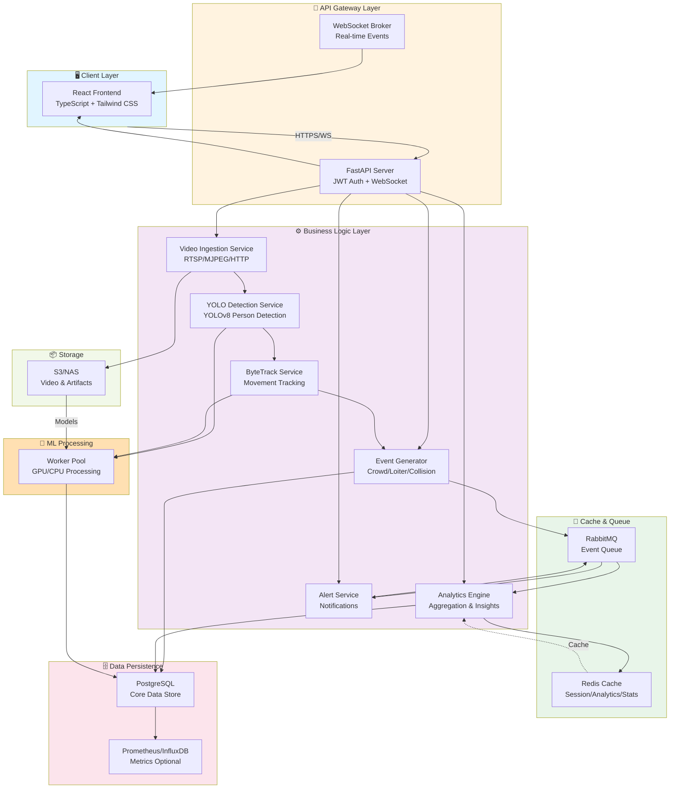
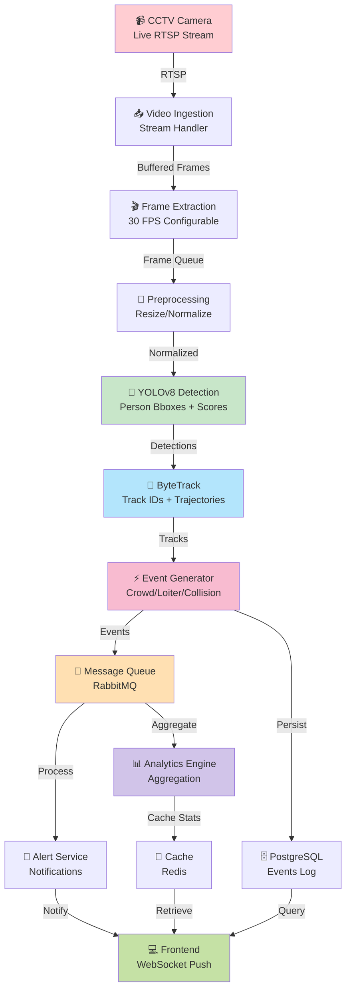
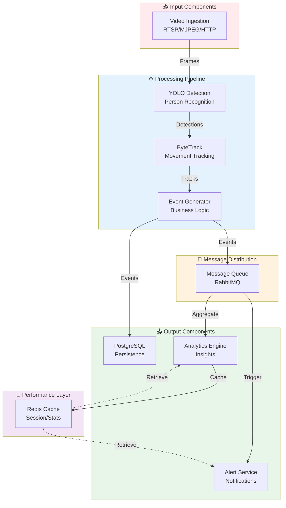
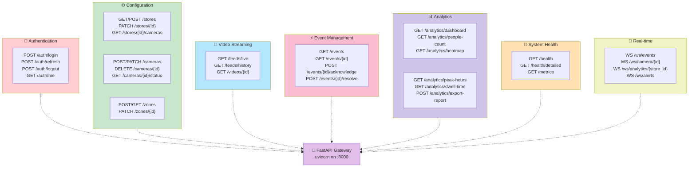
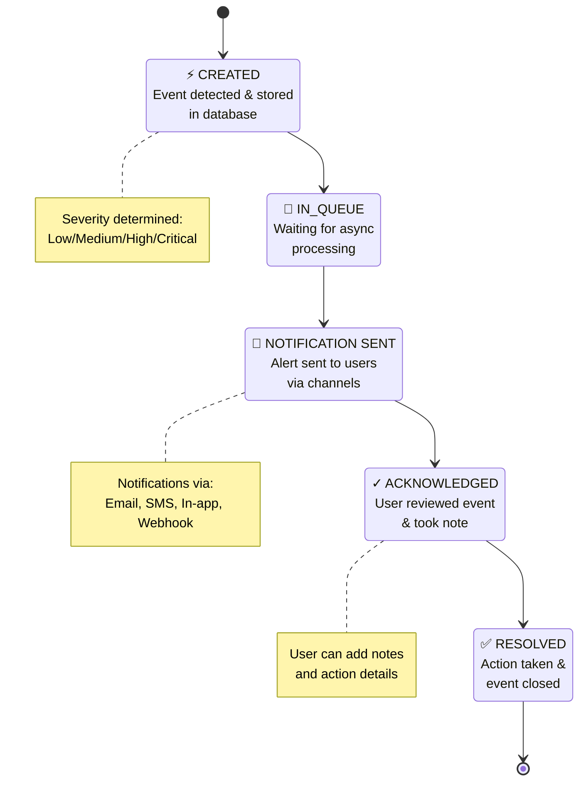
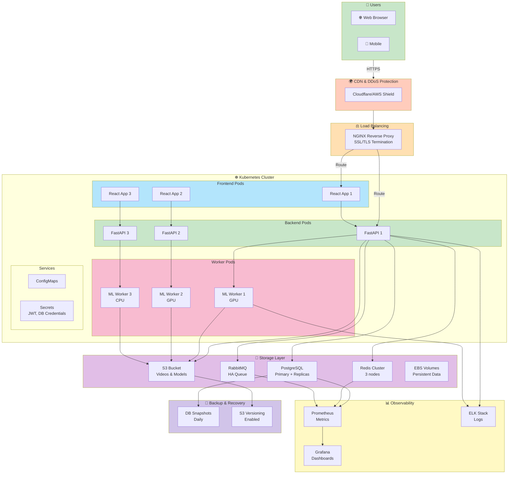

# AI-Powered Store Intelligence System - Architecture Design

## Executive Summary
A real-time CCTV footage analysis platform that detects people, tracks movements, generates actionable events, and provides analytics for retail store optimization.

---

## 1. HIGH-LEVEL ARCHITECTURE DIAGRAM

```
┌─────────────────────────────────────────────────────────────────────┐
│                         CLIENT LAYER                               │
├─────────────────────────────────────────────────────────────────────┤
│  React Frontend (Tailwind CSS)                                      │
│  ├─ Dashboard                  ├─ Video Feeds                       │
│  ├─ Analytics Reports          ├─ Real-time Events                 │
│  ├─ Configuration              └─ Heat Maps                         │
└──────────────────────────────┬──────────────────────────────────────┘
                               │ HTTPS/WebSocket
┌──────────────────────────────▼──────────────────────────────────────┐
│                         API GATEWAY LAYER                           │
├─────────────────────────────────────────────────────────────────────┤
│  FastAPI Server (uvicorn)                                           │
│  ├─ Authentication & Authorization (JWT)                           │
│  ├─ Rate Limiting & Request Validation                             │
│  ├─ WebSocket Manager (Real-time Events)                           │
│  └─ CORS & Security Headers                                        │
└────────────┬──────────────────────────────────────────┬────────────┘
             │                                          │
    ┌────────▼─────────┐                    ┌──────────▼────────┐
    │ REST API Routes  │                    │  WebSocket Broker │
    │ ├─ /auth         │                    │  (Event Streaming)│
    │ ├─ /feeds        │                    │                   │
    │ ├─ /events       │                    └───────────────────┘
    │ ├─ /analytics    │
    │ ├─ /configs      │
    │ └─ /health       │
    └────────┬─────────┘
             │
┌────────────▼─────────────────────────────────────────────────────────┐
│                      BUSINESS LOGIC LAYER                            │
├─────────────────────────────────────────────────────────────────────┤
│  ├─ Video Ingestion Service                                         │
│  ├─ YOLO Detection Service                                          │
│  ├─ ByteTrack Tracking Service                                      │
│  ├─ Event Generation Engine                                         │
│  ├─ Analytics Engine                                                │
│  ├─ Alert & Notification Service                                    │
│  └─ Data Aggregation Service                                        │
└────────────┬──────────────────────────────────────────┬────────────┘
             │                                          │
    ┌────────▼─────────────────┐        ┌──────────────▼────────┐
    │   Cache Layer (Redis)    │        │  Message Queue (RabbitMQ)   │
    │ ├─ Session Cache         │        │ ├─ Detection Tasks          │
    │ ├─ Analytics Cache       │        │ ├─ Event Processing Queue   │
    │ └─ Real-time Stats       │        │ └─ Notification Tasks       │
    └─────────────────────────┘        └──────────────────────────┘
             │
┌────────────▼─────────────────────────────────────────────────────────┐
│                      DATA PERSISTENCE LAYER                          │
├─────────────────────────────────────────────────────────────────────┤
│  PostgreSQL Database                                                │
│  ├─ Users & Authentication                                          │
│  ├─ Stores & Cameras Configuration                                  │
│  ├─ Video Metadata                                                  │
│  ├─ Detection & Tracking Data                                       │
│  ├─ Events Log                                                      │
│  ├─ Analytics Aggregates                                            │
│  └─ Alerts & Notifications                                          │
│                                                                     │
│  Time-Series Data (Prometheus/InfluxDB - Optional)                 │
│  └─ Metrics & Performance Data                                      │
└────────────┬─────────────────────────────────────────────────────────┘
             │
┌────────────▼─────────────────────────────────────────────────────────┐
│                      ML PROCESSING LAYER                             │
├─────────────────────────────────────────────────────────────────────┤
│  Worker Pool (Celery/FastAPI Background Tasks)                      │
│  ├─ YOLOv8 Person Detection Models (GPU/CPU)                       │
│  ├─ ByteTrack Tracking Engine                                       │
│  ├─ Video Frame Processing Pipeline                                 │
│  └─ Model Inference Optimization                                    │
└────────────┬─────────────────────────────────────────────────────────┘
             │
┌────────────▼─────────────────────────────────────────────────────────┐
│                      STORAGE LAYER                                   │
├─────────────────────────────────────────────────────────────────────┤
│  ├─ Video Storage (S3 / Local NAS)                                  │
│  ├─ Processed Frames Cache                                          │
│  ├─ Model Artifacts & Weights                                       │
│  └─ Logs & Audit Trails                                             │
└─────────────────────────────────────────────────────────────────────┘
```

---

## 1.1 ARCHITECTURE DIAGRAM (Mermaid)



---

## 2. COMPONENT INTERACTIONS

### 2.1 Data Flow Architecture (Mermaid)



### 2.1.1 Traditional Data Flow Architecture

```
CCTV Camera Feed
       │
       ▼
┌─────────────────────┐
│ Video Ingestion Svc │  (Handles RTSP/MJPEG/HTTP streams)
└────────┬────────────┘
         │ Frame Extraction (30 FPS configurable)
         ▼
    ┌─────────────────────────────────────┐
    │ Frame Preprocessing Pipeline        │
    │ ├─ Resize                           │
    │ ├─ Normalize                        │
    │ └─ Convert Color Space              │
    └────────┬────────────────────────────┘
             │
             ▼
    ┌─────────────────────────────────────┐
    │ YOLOv8 Detection Service (GPU)      │
    │ └─ Returns: Person bboxes + scores  │
    └────────┬────────────────────────────┘
             │
             ▼
    ┌─────────────────────────────────────┐
    │ ByteTrack Tracking Service          │
    │ └─ Returns: Track IDs + trajectories│
    └────────┬────────────────────────────┘
             │
             ▼
    ┌─────────────────────────────────────┐
    │ Event Generation Engine             │
    │ ├─ Crowd Detection (>N people)      │
    │ ├─ Loitering (>T seconds in area)   │
    │ ├─ Collision Detection              │
    │ ├─ Queue Formation                  │
    │ └─ Zone Violation                   │
    └────────┬────────────────────────────┘
             │
             ▼
    ┌─────────────────────────────────────┐
    │ Message Queue (RabbitMQ/Redis)      │
    │ └─ Queue Events for async processing│
    └────────┬────────────────────────────┘
             │
      ┌──────┴──────────────────┬──────────────┐
      ▼                         ▼              ▼
  ┌────────┐            ┌────────────┐   ┌─────────┐
  │Database│            │Alert Svc   │   │Analytics│
  │(Store) │            │(Notify)    │   │Engine   │
  └────────┘            └────────────┘   └─────────┘
      │                      │                 │
      ▼                      ▼                 ▼
  [Events Log]    [Notifications Queue]  [Analytics Cache]
      │                      │                 │
      └──────────────────────┴─────────────────┘
                    │
                    ▼
          [Frontend/Dashboard]
          (WebSocket Push Updates)
```

### 2.2 Key Component Interactions (Mermaid)



### 2.3 Component Interaction Matrix

| Component | Interacts With | Purpose |
|-----------|---|---|
| **Video Ingestion** | YOLO Detection | Feed frames for analysis |
| **YOLO Detection** | ByteTrack, Event Engine | Provide person detections |
| **ByteTrack** | Event Engine, Analytics | Track person movements |
| **Event Generator** | Message Queue, Database | Create actionable events |
| **Message Queue** | Alert Service, Analytics | Async event distribution |
| **Alert Service** | WebSocket Broker, Database | Send notifications |
| **Analytics Engine** | Database, Cache | Generate insights |
| **WebSocket Broker** | Frontend, Services | Real-time updates |
| **PostgreSQL** | All Services | Persistent storage |
| **Redis Cache** | Analytics, Sessions | Performance optimization |

---

## 3. FOLDER STRUCTURE

```
store-intelligence-system/
├── backend/
│   ├── app/
│   │   ├── __init__.py
│   │   ├── main.py                      # FastAPI app entry point
│   │   ├── config.py                    # Configuration management
│   │   ├── dependencies.py              # Dependency injection
│   │   │
│   │   ├── api/
│   │   │   ├── __init__.py
│   │   │   ├── v1/
│   │   │   │   ├── __init__.py
│   │   │   │   ├── auth.py              # Authentication endpoints
│   │   │   │   ├── feeds.py             # Video feed management
│   │   │   │   ├── events.py            # Event query endpoints
│   │   │   │   ├── analytics.py         # Analytics endpoints
│   │   │   │   ├── configs.py           # Configuration endpoints
│   │   │   │   ├── health.py            # Health check
│   │   │   │   └── websocket.py         # WebSocket handlers
│   │   │
│   │   ├── services/
│   │   │   ├── __init__.py
│   │   │   ├── video_ingestion.py       # Video stream handling
│   │   │   ├── detection.py             # YOLOv8 integration
│   │   │   ├── tracking.py              # ByteTrack integration
│   │   │   ├── event_generator.py       # Event creation logic
│   │   │   ├── alert_service.py         # Alerts & notifications
│   │   │   ├── analytics_engine.py      # Analytics computation
│   │   │   ├── cache_service.py         # Redis cache management
│   │   │   └── message_broker.py        # Message queue handling
│   │   │
│   │   ├── models/
│   │   │   ├── __init__.py
│   │   │   ├── database.py              # ORM models (SQLAlchemy)
│   │   │   ├── schemas.py               # Pydantic schemas
│   │   │   └── enums.py                 # Enumerations
│   │   │
│   │   ├── database/
│   │   │   ├── __init__.py
│   │   │   ├── connection.py            # DB connection pool
│   │   │   ├── crud.py                  # CRUD operations
│   │   │   └── migrations/              # Alembic migrations
│   │   │       ├── env.py
│   │   │       ├── script.py.mako
│   │   │       └── versions/
│   │   │
│   │   ├── ml/
│   │   │   ├── __init__.py
│   │   │   ├── yolo_detector.py         # YOLOv8 wrapper
│   │   │   ├── bytetrack.py             # ByteTrack wrapper
│   │   │   ├── models/                  # Model artifacts
│   │   │   │   ├── yolov8n.pt
│   │   │   │   └── README.md
│   │   │   └── utils.py                 # ML utilities
│   │   │
│   │   ├── utils/
│   │   │   ├── __init__.py
│   │   │   ├── logger.py                # Logging setup
│   │   │   ├── decorators.py            # Custom decorators
│   │   │   ├── validators.py            # Input validation
│   │   │   ├── security.py              # Security utilities
│   │   │   └── constants.py             # Constants
│   │   │
│   │   └── exceptions/
│   │       ├── __init__.py
│   │       └── custom_exceptions.py     # Custom exception classes
│   │
│   ├── tests/
│   │   ├── __init__.py
│   │   ├── conftest.py                  # Pytest fixtures
│   │   ├── unit/
│   │   │   ├── test_detection.py
│   │   │   ├── test_tracking.py
│   │   │   └── test_event_generator.py
│   │   ├── integration/
│   │   │   ├── test_api_endpoints.py
│   │   │   └── test_database.py
│   │   └── e2e/
│   │       └── test_full_pipeline.py
│   │
│   ├── requirements.txt
│   ├── requirements-dev.txt
│   ├── Dockerfile
│   ├── docker-compose.yml
│   └── .env.example
│
├── frontend/
│   ├── public/
│   │   ├── index.html
│   │   ├── favicon.ico
│   │   └── logo.svg
│   │
│   ├── src/
│   │   ├── index.tsx
│   │   ├── App.tsx
│   │   │
│   │   ├── components/
│   │   │   ├── common/
│   │   │   │   ├── Header.tsx
│   │   │   │   ├── Sidebar.tsx
│   │   │   │   ├── Footer.tsx
│   │   │   │   └── Loader.tsx
│   │   │   ├── dashboard/
│   │   │   │   ├── Dashboard.tsx
│   │   │   │   ├── StatsCard.tsx
│   │   │   │   ├── EventFeed.tsx
│   │   │   │   └── HeatMap.tsx
│   │   │   ├── feeds/
│   │   │   │   ├── FeedGrid.tsx
│   │   │   │   ├── VideoPlayer.tsx
│   │   │   │   └── FeedSelector.tsx
│   │   │   ├── analytics/
│   │   │   │   ├── AnalyticsDashboard.tsx
│   │   │   │   ├── CrowdChart.tsx
│   │   │   │   ├── HourlyTrends.tsx
│   │   │   │   └── PeakHours.tsx
│   │   │   ├── events/
│   │   │   │   ├── EventList.tsx
│   │   │   │   ├── EventDetail.tsx
│   │   │   │   └── EventFilter.tsx
│   │   │   └── config/
│   │   │       ├── CameraConfig.tsx
│   │   │       ├── AlertConfig.tsx
│   │   │       └── StoreConfig.tsx
│   │   │
│   │   ├── pages/
│   │   │   ├── HomePage.tsx
│   │   │   ├── LoginPage.tsx
│   │   │   ├── DashboardPage.tsx
│   │   │   ├── AnalyticsPage.tsx
│   │   │   ├── EventsPage.tsx
│   │   │   ├── ConfigPage.tsx
│   │   │   ├── NotFoundPage.tsx
│   │   │   └── ErrorBoundary.tsx
│   │   │
│   │   ├── services/
│   │   │   ├── api.ts                   # API client
│   │   │   ├── websocket.ts             # WebSocket client
│   │   │   ├── auth.ts                  # Auth service
│   │   │   ├── analytics.ts             # Analytics service
│   │   │   └── storage.ts               # Local storage wrapper
│   │   │
│   │   ├── hooks/
│   │   │   ├── useAuth.ts
│   │   │   ├── useFetch.ts
│   │   │   ├── useWebSocket.ts
│   │   │   ├── useAnalytics.ts
│   │   │   └── useLocalStorage.ts
│   │   │
│   │   ├── context/
│   │   │   ├── AuthContext.tsx
│   │   │   ├── EventContext.tsx
│   │   │   └── SettingsContext.tsx
│   │   │
│   │   ├── types/
│   │   │   ├── index.ts
│   │   │   ├── api.ts
│   │   │   ├── events.ts
│   │   │   ├── analytics.ts
│   │   │   └── common.ts
│   │   │
│   │   ├── styles/
│   │   │   ├── globals.css
│   │   │   ├── tailwind.config.js
│   │   │   └── theme.css
│   │   │
│   │   └── utils/
│   │       ├── formatting.ts
│   │       ├── validation.ts
│   │       ├── date-utils.ts
│   │       └── constants.ts
│   │
│   ├── tests/
│   │   ├── unit/
│   │   ├── integration/
│   │   └── e2e/
│   │
│   ├── package.json
│   ├── tsconfig.json
│   ├── tailwind.config.js
│   ├── postcss.config.js
│   ├── Dockerfile
│   ├── .env.example
│   └── .eslintrc.json
│
├── docker/
│   ├── Dockerfile.backend
│   ├── Dockerfile.frontend
│   ├── Dockerfile.worker
│   ├── entrypoint.sh
│   └── nginx.conf
│
├── nginx/
│   ├── nginx.conf
│   ├── ssl/
│   │   ├── cert.pem
│   │   └── key.pem
│   └── default.conf
│
├── database/
│   ├── init.sql
│   ├── migrations/
│   │   ├── 001_initial_schema.sql
│   │   ├── 002_create_indexes.sql
│   │   └── 003_create_partitions.sql
│   └── seed_data.sql
│
├── ml-models/
│   ├── yolov8n.pt                       # Nano model (~6MB)
│   ├── yolov8s.pt                       # Small model (~22MB)
│   ├── model_info.json
│   └── README.md
│
├── docs/
│   ├── ARCHITECTURE.md
│   ├── API_DOCUMENTATION.md
│   ├── DATABASE_SCHEMA.md
│   ├── SETUP_GUIDE.md
│   ├── DEPLOYMENT.md
│   ├── TROUBLESHOOTING.md
│   └── diagrams/
│       ├── architecture.png
│       └── data-flow.png
│
├── scripts/
│   ├── setup.sh
│   ├── migrate.sh
│   ├── seed_db.sh
│   ├── build.sh
│   ├── deploy.sh
│   └── health_check.sh
│
├── .github/
│   ├── workflows/
│   │   ├── ci.yml
│   │   ├── cd.yml
│   │   └── tests.yml
│   └── ISSUE_TEMPLATE/
│
├── docker-compose.yml
├── docker-compose.prod.yml
├── .dockerignore
├── .gitignore
├── .env.example
├── README.md
└── CONTRIBUTING.md
```

---

## 4. DATABASE SCHEMA

### 4.1 Core Tables

```sql
-- Users & Authentication
CREATE TABLE users (
    id UUID PRIMARY KEY DEFAULT gen_random_uuid(),
    username VARCHAR(50) UNIQUE NOT NULL,
    email VARCHAR(100) UNIQUE NOT NULL,
    password_hash VARCHAR(255) NOT NULL,
    first_name VARCHAR(50),
    last_name VARCHAR(50),
    role ENUM('admin', 'manager', 'analyst', 'viewer') NOT NULL,
    is_active BOOLEAN DEFAULT TRUE,
    last_login TIMESTAMP,
    created_at TIMESTAMP DEFAULT CURRENT_TIMESTAMP,
    updated_at TIMESTAMP DEFAULT CURRENT_TIMESTAMP
);

-- Stores
CREATE TABLE stores (
    id UUID PRIMARY KEY DEFAULT gen_random_uuid(),
    name VARCHAR(100) NOT NULL,
    location_name VARCHAR(100),
    address VARCHAR(255),
    latitude DECIMAL(10, 8),
    longitude DECIMAL(11, 8),
    timezone VARCHAR(50) DEFAULT 'UTC',
    is_active BOOLEAN DEFAULT TRUE,
    created_at TIMESTAMP DEFAULT CURRENT_TIMESTAMP,
    updated_at TIMESTAMP DEFAULT CURRENT_TIMESTAMP
);

-- Cameras
CREATE TABLE cameras (
    id UUID PRIMARY KEY DEFAULT gen_random_uuid(),
    store_id UUID NOT NULL REFERENCES stores(id) ON DELETE CASCADE,
    name VARCHAR(100) NOT NULL,
    rtsp_url VARCHAR(500) NOT NULL,
    stream_type ENUM('rtsp', 'mjpeg', 'http') NOT NULL,
    resolution VARCHAR(20) DEFAULT '1920x1080',
    fps INTEGER DEFAULT 30,
    status ENUM('active', 'inactive', 'error') DEFAULT 'inactive',
    location_description VARCHAR(255),
    zone_id UUID,  -- For zone-based analytics
    is_enabled BOOLEAN DEFAULT TRUE,
    last_heartbeat TIMESTAMP,
    created_at TIMESTAMP DEFAULT CURRENT_TIMESTAMP,
    updated_at TIMESTAMP DEFAULT CURRENT_TIMESTAMP,
    UNIQUE(store_id, name)
);

-- Zones (regions of interest within camera view)
CREATE TABLE zones (
    id UUID PRIMARY KEY DEFAULT gen_random_uuid(),
    camera_id UUID NOT NULL REFERENCES cameras(id) ON DELETE CASCADE,
    name VARCHAR(100) NOT NULL,
    zone_type ENUM('crowd_monitoring', 'checkout', 'entrance', 'custom') NOT NULL,
    polygon_coordinates JSONB NOT NULL,  -- GeoJSON format
    crowd_threshold INTEGER DEFAULT 5,
    alert_enabled BOOLEAN DEFAULT TRUE,
    created_at TIMESTAMP DEFAULT CURRENT_TIMESTAMP,
    updated_at TIMESTAMP DEFAULT CURRENT_TIMESTAMP
);

-- Video Metadata
CREATE TABLE videos (
    id UUID PRIMARY KEY DEFAULT gen_random_uuid(),
    camera_id UUID NOT NULL REFERENCES cameras(id) ON DELETE CASCADE,
    store_id UUID NOT NULL REFERENCES stores(id) ON DELETE CASCADE,
    video_path VARCHAR(500) NOT NULL,
    start_time TIMESTAMP NOT NULL,
    end_time TIMESTAMP,
    duration_seconds INTEGER,
    frame_count INTEGER,
    resolution VARCHAR(20),
    storage_size_mb DECIMAL(10, 2),
    processing_status ENUM('pending', 'processing', 'completed', 'failed') DEFAULT 'pending',
    created_at TIMESTAMP DEFAULT CURRENT_TIMESTAMP,
    updated_at TIMESTAMP DEFAULT CURRENT_TIMESTAMP,
    INDEX idx_camera_time (camera_id, start_time),
    INDEX idx_store_time (store_id, start_time)
);

-- Detection Results
CREATE TABLE detections (
    id BIGSERIAL PRIMARY KEY,
    video_id UUID NOT NULL REFERENCES videos(id) ON DELETE CASCADE,
    camera_id UUID NOT NULL REFERENCES cameras(id) ON DELETE CASCADE,
    frame_number INTEGER NOT NULL,
    timestamp TIMESTAMP NOT NULL,
    person_count INTEGER NOT NULL,
    detections JSONB NOT NULL,  -- Array of detection objects
    processing_time_ms INTEGER,
    created_at TIMESTAMP DEFAULT CURRENT_TIMESTAMP,
    INDEX idx_camera_timestamp (camera_id, timestamp),
    INDEX idx_video_frame (video_id, frame_number)
);

-- Tracking Data (Person Tracks)
CREATE TABLE tracks (
    id BIGSERIAL PRIMARY KEY,
    camera_id UUID NOT NULL REFERENCES cameras(id) ON DELETE CASCADE,
    track_id INTEGER NOT NULL,
    video_id UUID NOT NULL REFERENCES videos(id) ON DELETE CASCADE,
    start_frame INTEGER NOT NULL,
    end_frame INTEGER,
    start_timestamp TIMESTAMP NOT NULL,
    end_timestamp TIMESTAMP,
    duration_seconds DECIMAL(10, 2),
    centroid_path JSONB,  -- Array of [x, y] coordinates
    bounding_boxes JSONB,  -- Array of bbox objects
    zone_entries JSONB,    -- Zones entered during track
    track_status ENUM('active', 'completed') DEFAULT 'active',
    created_at TIMESTAMP DEFAULT CURRENT_TIMESTAMP,
    INDEX idx_camera_video (camera_id, video_id),
    INDEX idx_timestamp_range (start_timestamp, end_timestamp)
);

-- Events (Generated from detections/tracking)
CREATE TABLE events (
    id UUID PRIMARY KEY DEFAULT gen_random_uuid(),
    camera_id UUID NOT NULL REFERENCES cameras(id) ON DELETE CASCADE,
    store_id UUID NOT NULL REFERENCES stores(id) ON DELETE CASCADE,
    event_type ENUM(
        'crowd_detected',
        'loitering',
        'collision',
        'queue_formation',
        'zone_violation',
        'person_counted',
        'unusual_activity'
    ) NOT NULL,
    severity ENUM('low', 'medium', 'high', 'critical') NOT NULL,
    title VARCHAR(200) NOT NULL,
    description TEXT,
    event_data JSONB NOT NULL,  -- Flexible event metadata
    trigger_timestamp TIMESTAMP NOT NULL,
    detected_at TIMESTAMP NOT NULL DEFAULT CURRENT_TIMESTAMP,
    acknowledged BOOLEAN DEFAULT FALSE,
    acknowledged_by UUID REFERENCES users(id),
    acknowledged_at TIMESTAMP,
    resolved BOOLEAN DEFAULT FALSE,
    resolved_by UUID REFERENCES users(id),
    resolved_at TIMESTAMP,
    action_taken TEXT,
    related_video_id UUID REFERENCES videos(id),
    created_at TIMESTAMP DEFAULT CURRENT_TIMESTAMP,
    updated_at TIMESTAMP DEFAULT CURRENT_TIMESTAMP,
    INDEX idx_camera_time (camera_id, trigger_timestamp),
    INDEX idx_store_severity (store_id, severity, detected_at),
    INDEX idx_unresolved (resolved, detected_at)
);

-- Alerts & Notifications
CREATE TABLE alerts (
    id UUID PRIMARY KEY DEFAULT gen_random_uuid(),
    event_id UUID NOT NULL REFERENCES events(id) ON DELETE CASCADE,
    user_id UUID NOT NULL REFERENCES users(id) ON DELETE CASCADE,
    alert_type ENUM('email', 'sms', 'in_app', 'webhook') NOT NULL,
    status ENUM('pending', 'sent', 'failed') DEFAULT 'pending',
    recipient VARCHAR(255) NOT NULL,
    message TEXT,
    sent_at TIMESTAMP,
    delivery_attempts INTEGER DEFAULT 0,
    last_attempt_at TIMESTAMP,
    error_message TEXT,
    created_at TIMESTAMP DEFAULT CURRENT_TIMESTAMP
);

-- Analytics (Pre-aggregated for performance)
CREATE TABLE analytics_hourly (
    id BIGSERIAL PRIMARY KEY,
    camera_id UUID NOT NULL REFERENCES cameras(id) ON DELETE CASCADE,
    store_id UUID NOT NULL REFERENCES stores(id) ON DELETE CASCADE,
    hour TIMESTAMP NOT NULL,
    person_count_avg DECIMAL(10, 2),
    person_count_max INTEGER,
    person_count_min INTEGER,
    dwell_time_avg DECIMAL(10, 2),
    event_count INTEGER DEFAULT 0,
    crowd_events INTEGER DEFAULT 0,
    loitering_events INTEGER DEFAULT 0,
    created_at TIMESTAMP DEFAULT CURRENT_TIMESTAMP,
    UNIQUE(camera_id, hour),
    INDEX idx_store_hour (store_id, hour)
);

CREATE TABLE analytics_daily (
    id BIGSERIAL PRIMARY KEY,
    camera_id UUID NOT NULL REFERENCES cameras(id) ON DELETE CASCADE,
    store_id UUID NOT NULL REFERENCES stores(id) ON DELETE CASCADE,
    date DATE NOT NULL,
    person_count_avg DECIMAL(10, 2),
    person_count_max INTEGER,
    peak_hour TIME,
    total_duration_minutes INTEGER,
    total_events INTEGER,
    created_at TIMESTAMP DEFAULT CURRENT_TIMESTAMP,
    UNIQUE(camera_id, date),
    INDEX idx_store_date (store_id, date)
);

-- Configuration & Settings
CREATE TABLE settings (
    id UUID PRIMARY KEY DEFAULT gen_random_uuid(),
    store_id UUID REFERENCES stores(id) ON DELETE CASCADE,
    camera_id UUID REFERENCES cameras(id) ON DELETE CASCADE,
    setting_key VARCHAR(100) NOT NULL,
    setting_value JSONB NOT NULL,
    description TEXT,
    is_global BOOLEAN DEFAULT FALSE,
    created_at TIMESTAMP DEFAULT CURRENT_TIMESTAMP,
    updated_at TIMESTAMP DEFAULT CURRENT_TIMESTAMP,
    UNIQUE(camera_id, setting_key),
    UNIQUE(store_id, setting_key)
);

-- Audit Log
CREATE TABLE audit_logs (
    id BIGSERIAL PRIMARY KEY,
    user_id UUID REFERENCES users(id),
    action VARCHAR(100) NOT NULL,
    resource_type VARCHAR(50) NOT NULL,
    resource_id UUID,
    changes JSONB,
    ip_address INET,
    user_agent TEXT,
    created_at TIMESTAMP DEFAULT CURRENT_TIMESTAMP,
    INDEX idx_user_time (user_id, created_at),
    INDEX idx_resource (resource_type, resource_id)
);
```

### 4.2 Indexes & Performance Optimization

```sql
-- Event query optimization
CREATE INDEX idx_events_unresolved ON events(resolved, detected_at DESC) 
WHERE resolved = FALSE;

-- Time-series queries
CREATE INDEX idx_detections_ts ON detections(camera_id, timestamp DESC) 
USING BRIN;

CREATE INDEX idx_tracks_time ON tracks(camera_id, start_timestamp DESC) 
USING BRIN;

-- Video queries by camera
CREATE INDEX idx_videos_camera_recent ON videos(camera_id, start_time DESC) 
INCLUDE (duration_seconds, storage_size_mb);

-- Partial indexes for active cameras
CREATE INDEX idx_active_cameras ON cameras(store_id) 
WHERE is_enabled = TRUE;

-- Full-text search on event descriptions
CREATE INDEX idx_events_search ON events USING gin(
    to_tsvector('english', description)
);
```

### 4.3 Partitioning Strategy (Optional - for large scale)

```sql
-- Partition events by month
CREATE TABLE events_2024_01 PARTITION OF events
    FOR VALUES FROM ('2024-01-01') TO ('2024-02-01');

-- Partition detections by camera (sharding)
CREATE TABLE detections_shard_0 PARTITION OF detections
    FOR VALUES WITH (MODULUS 10, REMAINDER 0);
```

---

## 5. API DESIGN

### 5.0 API Structure Overview (Mermaid)



### 5.1 Authentication & Authorization

```
POST /api/v1/auth/login
  └─ Request: {username, password}
  └─ Response: {access_token, refresh_token, user}

POST /api/v1/auth/refresh
  └─ Headers: Authorization: Bearer <refresh_token>
  └─ Response: {access_token}

POST /api/v1/auth/logout
  └─ Headers: Authorization: Bearer <token>
  └─ Response: {message: "Logged out"}

GET /api/v1/auth/me
  └─ Headers: Authorization: Bearer <token>
  └─ Response: {user_details}
```

### 5.2 Store & Camera Management

```
GET /api/v1/stores
  └─ Query: ?limit=10&offset=0&search=store_name
  └─ Response: {stores: [Store], total: int, page: int}

POST /api/v1/stores
  └─ Body: {name, location, address, timezone}
  └─ Response: {store: Store}

PATCH /api/v1/stores/{store_id}
  └─ Body: {name?, location?, timezone?}
  └─ Response: {store: Store}

GET /api/v1/stores/{store_id}/cameras
  └─ Response: {cameras: [Camera]}

POST /api/v1/cameras
  └─ Body: {store_id, name, rtsp_url, stream_type, fps, location}
  └─ Response: {camera: Camera}

PATCH /api/v1/cameras/{camera_id}
  └─ Body: {name?, rtsp_url?, fps?, is_enabled?}
  └─ Response: {camera: Camera}

DELETE /api/v1/cameras/{camera_id}
  └─ Response: {message: "Camera deleted"}

GET /api/v1/cameras/{camera_id}/status
  └─ Response: {status: "active"|"inactive"|"error", uptime_hours: float}
```

### 5.3 Video Feeds & Streaming

```
GET /api/v1/feeds/{camera_id}/live
  └─ Headers: Accept: application/json | image/jpeg
  └─ Response: Live MJPEG stream OR latest frame + metadata

GET /api/v1/feeds/{camera_id}/history
  └─ Query: ?start_time=ISO8601&end_time=ISO8601&limit=100
  └─ Response: {videos: [VideoMetadata], total_duration_hours: float}

GET /api/v1/videos/{video_id}
  └─ Response: {video: VideoMetadata, detections_count: int, events_count: int}

GET /api/v1/videos/{video_id}/stream
  └─ Headers: Range: bytes=start-end
  └─ Response: Video stream (with HLS/DASH support)

POST /api/v1/feeds/{camera_id}/zones
  └─ Body: {name, type, polygon, crowd_threshold}
  └─ Response: {zone: Zone}

GET /api/v1/feeds/{camera_id}/zones
  └─ Response: {zones: [Zone]}
```

### 5.4 Events API

```
GET /api/v1/events
  └─ Query: ?store_id&camera_id&event_type&severity&start_date&end_date&limit
  └─ Response: {events: [Event], total: int, page: int}

GET /api/v1/events/{event_id}
  └─ Response: {event: EventDetail, related_frames: [Frame]}

POST /api/v1/events/{event_id}/acknowledge
  └─ Body: {notes?: string}
  └─ Response: {event: Event, acknowledged_at: timestamp}

POST /api/v1/events/{event_id}/resolve
  └─ Body: {action_taken: string, notes?: string}
  └─ Response: {event: Event, resolved_at: timestamp}

DELETE /api/v1/events/{event_id}
  └─ Query: ?soft_delete=true (soft delete by default)
  └─ Response: {message: "Event deleted"}

GET /api/v1/events/summary/today
  └─ Query: ?store_id&camera_id
  └─ Response: {
      total_events: int,
      by_type: {crowd_detected: int, loitering: int, ...},
      by_severity: {critical: int, high: int, ...}
    }

POST /api/v1/events/export
  └─ Query: ?format=csv|json&start_date&end_date
  └─ Response: File download
```

### 5.5 Analytics API

```
GET /api/v1/analytics/dashboard
  └─ Query: ?store_id&camera_id&period=today|week|month
  └─ Response: {
      total_people_count: int,
      peak_hours: [Hour],
      crowd_events: int,
      avg_dwell_time: float,
      trends: [TrendData],
      heatmap: Array2D
    }

GET /api/v1/analytics/people-count
  └─ Query: ?store_id&camera_id&granularity=hourly|daily&date
  └─ Response: {timestamps: [time], counts: [int]}

GET /api/v1/analytics/peak-hours
  └─ Query: ?store_id&date_range&days=7
  └─ Response: {peak_hours: [PeakHour], recommendations: [string]}

GET /api/v1/analytics/heatmap
  └─ Query: ?camera_id&date&hour_range=09:00-17:00
  └─ Response: {heatmap: [[int]], resolution: [width, height]}

GET /api/v1/analytics/dwell-time
  └─ Query: ?store_id&zone_id&period
  └─ Response: {avg_dwell_time: float, distribution: [float]}

GET /api/v1/analytics/crowd-analysis
  └─ Query: ?store_id&camera_id&date_range
  └─ Response: {
      avg_crowd_size: float,
      max_crowd_size: int,
      crowd_events: [Event],
      crowd_duration_avg: float
    }

POST /api/v1/analytics/export-report
  └─ Body: {period, metrics: [metric], format: pdf|excel}
  └─ Response: File download
```

### 5.6 Configuration API

```
GET /api/v1/config/detection-settings
  └─ Query: ?camera_id (if not provided, returns global defaults)
  └─ Response: {confidence_threshold, nms_threshold, model_version}

PATCH /api/v1/config/detection-settings
  └─ Body: {camera_id?, confidence_threshold?, nms_threshold?}
  └─ Response: {settings: DetectionSettings}

GET /api/v1/config/alert-rules
  └─ Query: ?store_id&camera_id
  └─ Response: {rules: [AlertRule]}

POST /api/v1/config/alert-rules
  └─ Body: {
      event_type,
      condition,
      severity_threshold,
      enabled,
      notification_channels: [email|sms|webhook]
    }
  └─ Response: {rule: AlertRule}

PATCH /api/v1/config/alert-rules/{rule_id}
  └─ Body: {condition?, enabled?, channels?}
  └─ Response: {rule: AlertRule}

DELETE /api/v1/config/alert-rules/{rule_id}
  └─ Response: {message: "Rule deleted"}
```

### 5.7 WebSocket Endpoints

```
WS /api/v1/ws/events
  └─ Authentication: ?token=JWT_TOKEN
  └─ Events sent: {type: "event_created"|"event_updated", data: Event}

WS /api/v1/ws/camera/{camera_id}
  └─ Real-time: Frame metadata, person count, detected zones
  └─ Message: {frame_number, person_count, timestamp, detections}

WS /api/v1/ws/analytics/{store_id}
  └─ Real-time: Analytics updates
  └─ Message: {current_people, peak_indicator, event_summary}

WS /api/v1/ws/alerts
  └─ Real-time: Alert notifications
  └─ Message: {event_id, severity, camera_id, title}
```

### 5.8 Health & Monitoring

```
GET /api/v1/health
  └─ Response: {status: "healthy"|"degraded"|"unhealthy", timestamp}

GET /api/v1/health/detailed
  └─ Response: {
      database: {status, latency_ms},
      cache: {status, latency_ms},
      message_queue: {status, queue_depth},
      ml_service: {status, gpu_utilization},
      uptime_hours: float
    }

GET /api/v1/metrics
  └─ Response: Prometheus metrics format
```

---

## 6. EVENT SCHEMA

### 6.1 Event Structure

```typescript
interface BaseEvent {
    id: UUID;
    camera_id: UUID;
    store_id: UUID;
    event_type: EventType;
    severity: Severity;
    title: string;
    description: string;
    trigger_timestamp: ISO8601;
    detected_at: ISO8601;
    
    // Resolution
    acknowledged: boolean;
    acknowledged_by?: UUID;
    acknowledged_at?: ISO8601;
    resolved: boolean;
    resolved_by?: UUID;
    resolved_at?: ISO8601;
    action_taken?: string;
    
    // References
    related_video_id?: UUID;
    related_track_ids?: [TrackID];
}
```

### 6.2 Specific Event Types

```typescript
// 1. Crowd Detection Event
interface CrowdDetectedEvent extends BaseEvent {
    event_type: 'crowd_detected';
    event_data: {
        zone_id: UUID;
        zone_name: string;
        person_count: number;
        threshold: number;
        confidence: float;
        centroid: [x, y];
        bbox: [x1, y1, x2, y2];
        duration_seconds: number;
        frame_numbers: [start, end];
    };
}

// 2. Loitering Event
interface Loi teringEvent extends BaseEvent {
    event_type: 'loitering';
    event_data: {
        track_id: TrackID;
        zone_id: UUID;
        zone_name: string;
        duration_seconds: number;
        threshold_seconds: number;
        centroid_start: [x, y];
        centroid_end: [x, y];
        movement_distance_pixels: number;
    };
}

// 3. Collision Detection
interface CollisionEvent extends BaseEvent {
    event_type: 'collision';
    event_data: {
        track_ids: [TrackID];
        person_count: number;
        collision_point: [x, y];
        collision_severity: 'light' | 'moderate' | 'severe';
        frame_number: int;
    };
}

// 4. Queue Formation
interface QueueFormationEvent extends BaseEvent {
    event_type: 'queue_formation';
    event_data: {
        zone_id: UUID;
        zone_name: string;
        queue_length: number;
        estimated_wait_time_minutes: number;
        queue_orientation: 'horizontal' | 'vertical' | 'diagonal';
        track_ids: [TrackID];
    };
}

// 5. Zone Violation
interface ZoneViolationEvent extends BaseEvent {
    event_type: 'zone_violation';
    event_data: {
        zone_id: UUID;
        zone_name: string;
        restricted_access: boolean;
        track_id: TrackID;
        entry_point: [x, y];
        violation_duration_seconds: number;
    };
}

// 6. Person Counted
interface PersonCountedEvent extends BaseEvent {
    event_type: 'person_counted';
    event_data: {
        count_type: 'entry' | 'exit' | 'zone_entry' | 'zone_exit';
        zone_id?: UUID;
        track_id: TrackID;
        entry_exit_point: [x, y];
        direction: 'in' | 'out';
        daily_total?: number;
    };
}

// 7. Unusual Activity
interface UnusualActivityEvent extends BaseEvent {
    event_type: 'unusual_activity';
    event_data: {
        activity_description: string;
        anomaly_score: float;
        track_ids: [TrackID];
        activity_features: object;
    };
}
```

### 6.3 Event Severity Levels

| Severity | Description | Response Time |
|----------|---|---|
| **Low** | Non-urgent information | 24 hours |
| **Medium** | Attention needed | 4 hours |
| **High** | Immediate action required | 1 hour |
| **Critical** | Emergency | 15 minutes |

### 6.4 Event Lifecycle (Mermaid)



### 6.4.1 Traditional Event Lifecycle

```
┌─────────────┐
│   CREATED   │  Event detected and stored
└──────┬──────┘
       │
       ▼
┌─────────────────┐
│   IN_QUEUE      │  Waiting for processing
└──────┬──────────┘
       │
       ▼
┌─────────────────┐
│  NOTIFICATION   │  Alert sent to users
│     SENT        │
└──────┬──────────┘
       │
       ▼
┌─────────────────────┐
│   ACKNOWLEDGED      │  User reviewed event
└──────┬──────────────┘
       │
       ▼
┌─────────────────────┐
│    RESOLVED         │  Action taken
└─────────────────────┘
```

---

## 7. DEVELOPMENT ROADMAP

### Phase 1: Foundation (Weeks 1-4)
**Objective**: Core infrastructure and basic functionality

- [ ] **Backend Setup**
  - [ ] FastAPI project structure
  - [ ] PostgreSQL schema implementation
  - [ ] Docker containerization
  - [ ] Authentication (JWT)
  - [ ] Basic CRUD APIs

- [ ] **Frontend Setup**
  - [ ] React + TypeScript project
  - [ ] Tailwind CSS configuration
  - [ ] Component library foundation
  - [ ] Routing & layout

- [ ] **Infrastructure**
  - [ ] Docker Compose setup
  - [ ] Nginx reverse proxy
  - [ ] Development environment

### Phase 2: ML Integration (Weeks 5-8)
**Objective**: YOLOv8 and ByteTrack integration

- [ ] **Detection Service**
  - [ ] YOLOv8 model integration
  - [ ] Frame extraction pipeline
  - [ ] Batch processing optimization
  - [ ] GPU support

- [ ] **Tracking Service**
  - [ ] ByteTrack implementation
  - [ ] Track management
  - [ ] Track visualization

- [ ] **Video Processing**
  - [ ] RTSP stream ingestion
  - [ ] Frame buffering
  - [ ] Storage management

### Phase 3: Event & Analytics (Weeks 9-12)
**Objective**: Business logic and analytics engine

- [ ] **Event Generation**
  - [ ] Crowd detection logic
  - [ ] Loitering detection
  - [ ] Collision detection
  - [ ] Zone violations

- [ ] **Analytics Engine**
  - [ ] People count aggregation
  - [ ] Peak hour detection
  - [ ] Heatmap generation
  - [ ] Dwell time calculation

- [ ] **Alerting System**
  - [ ] Alert rules engine
  - [ ] Notification channels
  - [ ] Webhook integration

### Phase 4: Frontend & UI (Weeks 13-16)
**Objective**: Complete user interface

- [ ] **Dashboard**
  - [ ] Real-time statistics
  - [ ] Event feed
  - [ ] Camera overview

- [ ] **Analytics Views**
  - [ ] Charts & graphs
  - [ ] Heatmaps
  - [ ] Reports generation

- [ ] **Configuration UI**
  - [ ] Camera management
  - [ ] Alert rules setup
  - [ ] Zone configuration

### Phase 5: Production Ready (Weeks 17-20)
**Objective**: Performance, security, and deployment

- [ ] **Performance Optimization**
  - [ ] Model optimization (quantization)
  - [ ] Caching strategies
  - [ ] Database indexing
  - [ ] Load testing

- [ ] **Security Hardening**
  - [ ] RBAC implementation
  - [ ] API rate limiting
  - [ ] Data encryption
  - [ ] Security audit

- [ ] **Deployment & Monitoring**
  - [ ] Kubernetes deployment
  - [ ] Prometheus monitoring
  - [ ] Logging infrastructure
  - [ ] CI/CD pipeline

### Phase 6: Advanced Features (Weeks 21+)
**Objective**: Extended functionality

- [ ] Multi-store management
- [ ] Custom ML models
- [ ] Advanced analytics
- [ ] Mobile app
- [ ] Edge deployment
- [ ] Real-time streaming to cloud

### Milestone Timeline

```
┌──────────────────────────────────────────────────────────────────┐
│ Week  │ Phase 1    │ Phase 2    │ Phase 3    │ Phase 4    │ Phase 5│
│       │ Foundation │ ML Integ.  │ Analytics  │ Frontend   │ Prod   │
├───────┼────────────┼────────────┼────────────┼────────────┼────────┤
│ 1-4   │ ████████   │            │            │            │        │
│ 5-8   │            │ ████████   │            │            │        │
│ 9-12  │            │            │ ████████   │            │        │
│ 13-16 │            │            │            │ ████████   │        │
│ 17-20 │            │            │            │            │ ████   │
└──────────────────────────────────────────────────────────────────┘

MVP: End of Week 12 (Basic end-to-end functionality)
Beta: End of Week 16 (Full UI)
Production: End of Week 20 (Optimized & Secure)
```

### Key Dependencies

```
Backend Framework (FastAPI)
    ├─ PostgreSQL Database ─────────┐
    ├─ YOLOv8 Detection             ├─ Analytics Engine
    ├─ ByteTrack Tracking           ├─ Event System
    ├─ Redis Cache                  ├─ Notification Service
    └─ RabbitMQ Queue ──────────────┤
                                    └─ API Endpoints
                                            │
                                            ▼
                                    Frontend (React)
                                    ├─ Dashboard
                                    ├─ Analytics Views
                                    └─ Configuration UI
```

### Success Criteria

| Metric | Target | Measurement |
|--------|--------|---|
| **Detection Accuracy** | >95% | mAP@0.5 on test dataset |
| **Frame Processing Speed** | <100ms | 30 FPS @ 1920x1080 |
| **Event Latency** | <500ms | From detection to event creation |
| **API Response Time** | <200ms | P95 for dashboard queries |
| **System Uptime** | >99.5% | Monthly availability |
| **False Positive Rate** | <5% | Events per 1000 frames |
| **System Scalability** | 16+ cameras | Concurrent processing |

---

## 8. TECHNOLOGY STACK DIAGRAM (Mermaid)

```mermaid
graph TB
    subgraph Frontend["🖥️ FRONTEND LAYER"]
        React["React 18+<br/>TypeScript"]
        Tailwind["Tailwind CSS<br/>Styling"]
        Redux["Redux Toolkit<br/>State Mgmt"]
        Axios["Axios/React Query<br/>HTTP Client"]
        WebSocket["Socket.IO<br/>Real-time"]
        Charts["Recharts/Chart.js<br/>Visualization"]
        Video["Video.js/HLS.js<br/>Video Playback"]
        Vite["Vite<br/>Build Tool"]
    end
    
    subgraph Backend["⚙️ BACKEND LAYER"]
        FastAPI["FastAPI 0.104+<br/>Web Framework"]
        Uvicorn["Uvicorn<br/>ASGI Server"]
        SQLAlchemy["SQLAlchemy 2.0<br/>ORM"]
        Pydantic["Pydantic V2<br/>Validation"]
        PyJWT["PyJWT<br/>Authentication"]
        Celery["Celery<br/>Task Queue"]
    end
    
    subgraph Data["📊 DATA LAYER"]
        PostgreSQL["PostgreSQL 14+<br/>Primary DB"]
        Redis["Redis 7+<br/>Cache"]
        RabbitMQ["RabbitMQ<br/>Message Queue"]
        InfluxDB["InfluxDB/Prometheus<br/>Time-series"]
    end
    
    subgraph ML["🧠 ML LAYER"]
        PyTorch["PyTorch<br/>Deep Learning"]
        OpenCV["OpenCV<br/>Computer Vision"]
        YOLO["YOLOv8<br/>Object Detection"]
        ByteTrack["ByteTrack<br/>Multi-Object Tracking"]
        NumPy["NumPy/Pandas<br/>Data Processing"]
    end
    
    subgraph DevOps["🚀 DEVOPS LAYER"]
        Docker["Docker<br/>Containerization"]
        Compose["Docker Compose<br/>Orchestration"]
        Kubernetes["Kubernetes/K3s<br/>Container Orchestration"]
        Nginx["Nginx<br/>Reverse Proxy"]
        GitActions["GitHub Actions<br/>CI/CD"]
    end
    
    subgraph Testing["✅ TESTING"]
        Pytest["Pytest<br/>Backend Tests"]
        Vitest["Vitest<br/>Frontend Tests"]
        RTL["React Testing Lib<br/>Component Tests"]
        Postman["Postman/API Client<br/>Integration Tests"]
    end
    
    subgraph Monitoring["📈 MONITORING"]
        Prometheus["Prometheus<br/>Metrics Collection"]
        Grafana["Grafana<br/>Dashboards"]
        ELK["ELK Stack<br/>Centralized Logs"]
        Datadog["Datadog Optional<br/>APM"]
    end
    
    React --> Vite
    Tailwind --> React
    Redux --> React
    Axios --> React
    WebSocket --> React
    Charts --> React
    Video --> React
    
    FastAPI --> Uvicorn
    SQLAlchemy --> PostgreSQL
    Pydantic --> FastAPI
    PyJWT --> FastAPI
    Celery --> RabbitMQ
    
    FastAPI --> PostgreSQL
    FastAPI --> Redis
    FastAPI --> RabbitMQ
    
    PyTorch --> YOLO
    OpenCV --> ByteTrack
    YOLO --> NumPy
    ByteTrack --> NumPy
    
    Docker --> Compose
    Compose --> Kubernetes
    Kubernetes --> Nginx
    GitActions --> Docker
    
    Pytest --> FastAPI
    Vitest --> React
    RTL --> React
    Postman --> FastAPI
    
    FastAPI --> Prometheus
    FastAPI --> ELK
    Prometheus --> Grafana
    
    style Frontend fill:#e3f2fd
    style Backend fill:#c8e6c9
    style Data fill:#f8bbd0
    style ML fill:#ffe0b2
    style DevOps fill:#e1bee7
    style Testing fill:#fff9c4
    style Monitoring fill:#ffccbc
```



---

## 8. TECHNOLOGY STACK SUMMARY

### Backend
- **Framework**: FastAPI 0.104+
- **Server**: Uvicorn
- **ORM**: SQLAlchemy 2.0
- **Database**: PostgreSQL 14+
- **Cache**: Redis 7+
- **Message Queue**: RabbitMQ / Celery
- **ML**: PyTorch, OpenCV, YOLOv8, ByteTrack
- **Validation**: Pydantic V2
- **Auth**: PyJWT
- **Logging**: Python logging + ELK
- **Testing**: pytest, pytest-asyncio

### Frontend
- **Framework**: React 18+
- **Language**: TypeScript
- **Styling**: Tailwind CSS
- **State Management**: Redux Toolkit / Zustand
- **HTTP Client**: Axios / TanStack Query
- **WebSocket**: Socket.IO
- **Charts**: Recharts / Chart.js
- **Video**: Video.js / HLS.js
- **Build**: Vite
- **Testing**: Vitest, React Testing Library

### Infrastructure
- **Containerization**: Docker & Docker Compose
- **Web Server**: Nginx
- **Reverse Proxy**: Nginx
- **Monitoring**: Prometheus + Grafana
- **Logging**: ELK Stack (Elasticsearch, Logstash, Kibana)
- **CI/CD**: GitHub Actions / GitLab CI
- **Kubernetes**: Minikube (development), K3s / EKS (production)

---

## 9. DEPLOYMENT ARCHITECTURE (Mermaid)



## 9. DEPLOYMENT CONSIDERATIONS

### Development
- Docker Compose with hot reload
- SQLite fallback option
- Mock RTSP streams for testing

### Staging
- Kubernetes (3-node cluster)
- PostgreSQL with replication
- Redis cluster
- Load testing environment

### Production
- Kubernetes (HA setup, 5+ nodes)
- PostgreSQL with streaming replication & backup
- Redis cluster with persistence
- CDN for frontend
- DDoS protection
- SSL/TLS certificates
- Rate limiting & throttling
- Horizontal pod autoscaling
- Database connection pooling

---

This comprehensive architecture provides a solid foundation for a production-ready Store Intelligence System. Each component is designed for scalability, reliability, and maintainability.

